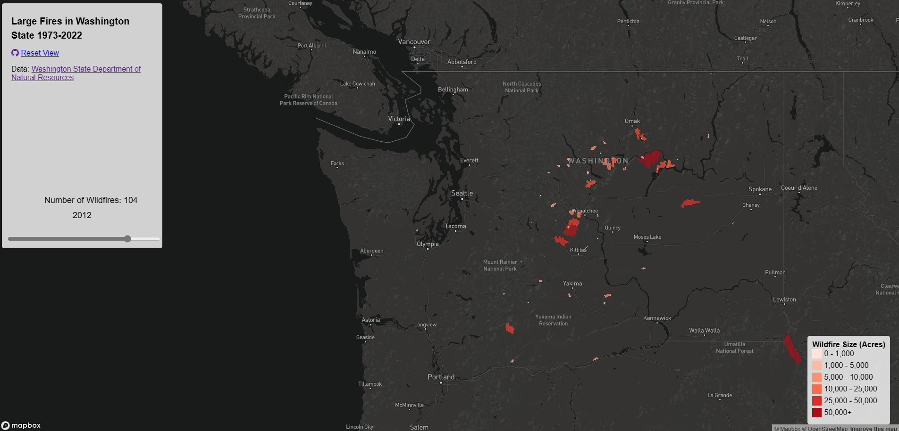
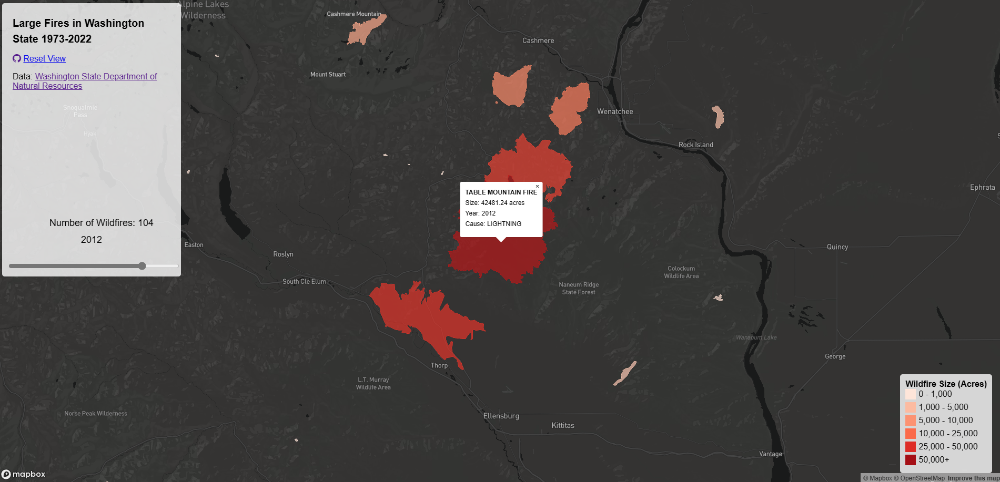

# Washington State Wildfire Data

The map I created shows historical wildfire data in Washington State.
It's an interactive map that allows the user to scroll through the years 1973-2022 with a time slider that changes the visualization of the map depending on the number of wildfires that year. I chose to use a choropleth map because I felt as if it's the best way of visualizating the intensity and size of each of the wildfires. The color scale ranges from a whitish-pink to dark red, depending on how big the wildfire was by acreage.

The interactive elements include the choropleth itself, yearly wildfire count, and year that the wildfires took place.

## Deployment
[Live GitHub Page](https://qnn16.github.io/wildfires/)

## Image
>Example Photos

## Data Source
[WADNR](https://geo.wa.gov/datasets/wadnr::washington-large-fires-1973-2022/about)
>Washington State Department of Natural Resources
